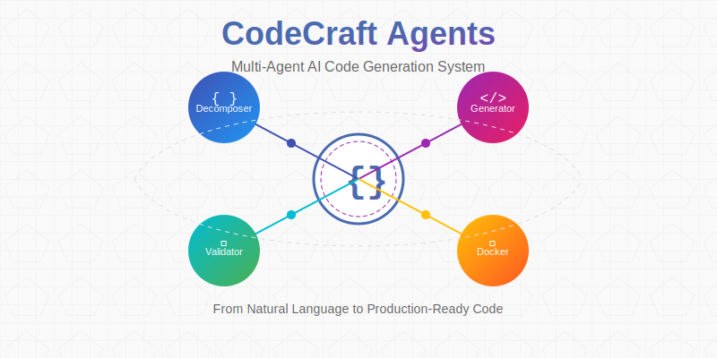

# CodeCraft Agents




> Transform natural language task descriptions into fully functional, tested, and dockerized code solutions

## 🌐 Other Languages

- [README in Ukrainian](readme.uk.md)

## 🚀 Overview

CodeCraft Agents is an advanced multi-agent AI system that automatically converts natural language descriptions into production-ready code. The project demonstrates the power of specialized AI agents working in collaboration to handle the entire software development lifecycle - from task analysis to deployment.

**Note:** This is a prototype version currently optimized for single-file applications.

## ✨ Key Features

- **Fully Automated Code Generation** - From concept to working code with minimal human intervention
- **Multi-Agent Architecture** - Specialized agents for each development stage
- **Comprehensive Verification** - Built-in testing, validation, and feedback loops
- **Docker Integration** - Automatic containerization of generated applications
- **Knowledge Extraction** - Continuous learning from generated solutions

## 🤖 Agent System Architecture

Our system employs a specialized agent for each stage of the development process:

1. **DecomposerAgent** - Breaks down the task description into structured modules and interfaces
2. **ValidatorAgent** - Verifies the completeness and correctness of the plan
3. **ConsistencyAgent** - Checks for data type and logic consistency across modules
4. **CodeGeneratorAgent** - Creates the actual code based on the approved plan
5. **CodeExtractorAgent** - Saves the code to appropriate files
6. **DockerRunnerAgent** - Generates Dockerfile and docker-compose configurations
7. **TesterAgent** - Creates test cases and validates application functionality
8. **DocumentationAgent** - Generates comprehensive usage documentation
9. **MonitorAgent** & **CoordinatorAgent** - Oversee the process and manage workflow transitions

## 🔄 How It Works

When you provide a task description to CodeCraft Agents, the system follows this workflow:

1. **Task Analysis** - The DecomposerAgent breaks down the task into manageable components
2. **Planning & Validation** - The system creates and verifies a comprehensive development plan
3. **Code Generation** - Clean, efficient code is created based on the approved plan
4. **Testing & Containerization** - The code is thoroughly tested and packaged in a Docker container
5. **Documentation** - Comprehensive usage documentation is automatically generated

The entire process is governed by our adaptive feedback loop, which ensures high-quality output through multiple verification layers.

## 📋 Example Use Case

Given a simple input:

```
Create an API server with route /sum that takes two GET parameters a and b (numbers) and returns their sum. Use aiohttp.
```

CodeCraft Agents will produce:

1. A working Python application with error handling and proper structure
2. Dockerized environment for easy deployment
3. Test suite to verify functionality
4. Comprehensive documentation for usage and deployment

## 🛠️ Technical Implementation

The system is built on a modular architecture that includes:

- Advanced prompt engineering for specialized agent roles
- Verification mechanisms for quality control
- Adaptive feedback loops for error correction
- Isolated execution environments for testing
- Vector knowledge base for context enhancement

## 🔍 Current Limitations

As a prototype, CodeCraft Agents currently has some limitations:

- Optimized for single-file Python applications
- Works best with web API and basic utility applications
- Limited complexity in database relationships and authentication
- Does not yet support full-scale multi-file projects

## 🚀 Getting Started

### Prerequisites

- Python 3.9 or higher
- Docker and docker-compose
- Access to OpenRouter API
- Qdrant for vector storage

### Installation

1. Clone the repository:
```bash
git clone https://github.com/yourusername/codecraft-agents.git
cd codecraft-agents
```

2. Install dependencies:
```bash
pip install -r requirements.txt
```

3. Start Qdrant using docker-compose:
```bash
docker-compose up -d
```

4. Set your OpenRouter API key:
```bash
export OPENROUTER_API_KEY=your_key_here
```

### Usage

Run the system with a task description:

```bash
python main.py
```

By default, the system will generate code for a sample task. To customize, edit the `task` variable in `main.py`.

Output files will be created in the `project/` directory.

## 📚 Documentation

For more detailed information on the system's architecture and components, see:

- [Agent Architecture](docs/agent-architecture.md)
- [Prompt Engineering Details](docs/prompts.md)
- [Verification System](docs/verification.md)
- [Feedback Loop Mechanism](docs/feedback-loop.md)

## 🌐 Other Languages

- [README in Ukrainian](README.uk.md)

## 📈 Future Roadmap

- Multi-file project support
- Additional programming languages
- Frontend code generation
- More complex database integrations
- CI/CD pipeline generation
- Enhanced knowledge extraction and reuse
- React and other frontend framework support

## 📄 License

This project is licensed under the Apache License 2.0 - see the [LICENSE.md](LICENSE.md) file for details.

## 🤝 Contributing

Contributions are welcome! Please feel free to submit a Pull Request.

---

<p align="center">
  <small>Built with ❤️ by the CodeCraft Agents Team</small>
</p>
